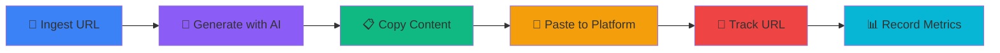

<div align="center">

# 🚀 Navam Marketer

### Marketing Automation Made Simple — Truly Local-First

*Transform your content into social promotions with AI — Copy, paste, post. No OAuth, no complexity.*

[](https://github.com/yourusername/navam-marketer)
[](https://nextjs.org/)
[](https://www.typescriptlang.org/)
[](https://github.com/yourusername/navam-marketer)
[](LICENSE)

[Features](#-features) • [Quick Start](#-quick-start) • [Tech Stack](#️-tech-stack) • [Philosophy](#-philosophy) • [Roadmap](#-roadmap)


</div>

---

## 📖 About

**Navam Marketer** is a marketing automation tool built for **bootstrapped startup founders** who need to maintain a social media presence without a marketing team. It uses AI to transform existing content into platform-optimized posts, with a **simple copy-paste workflow** that works with any social platform.

<table>
<tr>
<td width="50%">

### 🎯 Built for Founders

No marketing team? No problem. Automate content repurposing with AI while maintaining complete control over what gets published.

</td>
<td width="50%">

### 💎 MLP Philosophy

Minimum **Lovable** Product — not just viable, but delightful. Beautiful UI, smooth UX, and thoughtful details from day one.

</td>
</tr>
<tr>
<td width="50%">

### 🔄 Human-in-Loop

Review and edit everything before publishing. AI generates, you approve. No auto-posting means no surprises.

</td>
<td width="50%">

### 🏠 True Local-First

Runs completely offline with SQLite. No OAuth, no external dependencies (except Claude for content generation). Your data stays local.

</td>
</tr>
</table>

---

## ✨ Features

> **v1.0.0 Highlight:** We've removed LinkedIn OAuth and auto-posting in favor of a simpler, more reliable copy-paste workflow. See [What's New](#-whats-new-in-v100) below.

### Core Workflow



<details open>
<summary><b>🔗 Source Ingestion</b> <code>v0.1.0</code></summary>

<br>

Extract clean, readable content from any URL with a single click.

- **Intelligent Parsing** — Powered by Mozilla Readability
- **Clean Output** — Removes ads, clutter, and navigation
- **Database Storage** — Saved for future campaign use
- **Source Management** — Dedicated page to view and manage all sources
- **Multi-Source Support** — Generate from any saved source

**Example:** Paste a Medium article URL, get clean markdown content ready for AI processing.

</details>

<details open>
<summary><b>🤖 AI Content Generation</b> <code>v0.3.0</code></summary>

<br>

Generate platform-optimized posts with Claude AI (Sonnet 4.5).

**Multi-Platform Generation**
- 📱 **LinkedIn**: Professional posts (3000 chars, 3-5 hashtags)
- 🐦 **Twitter**: Punchy tweets (280 chars, 1-2 hashtags)
- 📝 **Blog**: Introduction paragraphs (500 chars)

**Customization Options**
- **Tone Selection:** Professional, Casual, Technical, Enthusiastic
- **Call-to-Action:** Optional CTA for driving engagement
- **Source-Based:** Generate from ingested content

**Features**
- Batch generation for all platforms at once
- Preview before saving to kanban
- Tasks created in Draft status for review
- Powered by Claude Sonnet 4.5 via Anthropic SDK

</details>

<details open>
<summary><b>📋 Campaign & Task Management</b> <code>v0.2.0</code></summary>

<br>

Organize your social media workflow with an intuitive Kanban board.

**Campaign Management**
- Create unlimited campaigns with names and descriptions
- Track task counts per campaign
- Archive/restore campaigns for organization
- Export/import campaigns as JSON
- Duplicate campaigns with one click

**Kanban Board**
- 🗂️ **4 Status Columns:** To Do → Draft → Scheduled → Posted
- 🖱️ **Drag & Drop:** Smooth task movement with visual feedback
- ✏️ **Inline Editing:** Edit post content directly on cards
- 🏷️ **Platform Tags:** LinkedIn, Twitter, Blog with color coding
- 🔄 **Real-Time Updates:** Instant sync with database

**Task Features**
- Platform-specific categorization
- Scheduled date tracking (for planning, not auto-posting)
- Delete with confirmation
- Content preview with line clamping

</details>

<details open>
<summary><b>📋 Manual Copy-Paste Workflow</b> <code>v1.0.0</code> 🆕</summary>

<br>

Simple, reliable workflow that works with **any social platform** — no OAuth required.

**Copy to Clipboard**
- 📋 **One-Click Copy** — Copy button on every task card
- ✅ **Toast Confirmation** — "Post content copied to clipboard!"
- 🎯 **Works Everywhere** — LinkedIn, Twitter, Facebook, Instagram, Threads, etc.

**Manual Post URL Tracking**
- 🔗 **Add URL** — Link icon on posted tasks opens URL input
- 💾 **Save & Display** — Published URLs saved and shown as "View Post" link
- 🌐 **Platform Agnostic** — Works with any social platform URL
- 📊 **Optional** — Track URLs for reference, or skip if not needed

**Benefits**
- ✅ No OAuth setup or token management
- ✅ No API rate limits or failures
- ✅ Works with platforms beyond LinkedIn/Twitter
- ✅ Review post on platform before publishing
- ✅ Platform updates won't break your workflow
- ✅ Better privacy — no stored credentials

**Workflow Example**
```
1. Generate content with AI
2. Click copy button on task card
3. Open LinkedIn/Twitter/etc.
4. Paste content (Cmd+V / Ctrl+V)
5. Edit and publish manually
6. (Optional) Copy post URL and add to task
7. (Optional) Record engagement metrics
```

</details>

<details open>
<summary><b>📊 Performance Dashboard</b> <code>v0.6.0</code></summary>

<br>

Track your social media engagement with real-time metrics and beautiful visualizations.

**KPI Cards**
- 📊 **Total Posts**: Count of published content
- 👆 **Total Clicks**: Link clicks via tracking
- ❤️ **Total Likes**: Engagement metrics
- 🔄 **Total Shares**: Content sharing stats

**Engagement Chart**
- 📈 Line chart showing metrics over last 30 days
- Multiple data series (clicks, likes, shares)
- Interactive tooltips and legend
- Responsive design for all screen sizes

**Manual Metric Recording** <code>v0.7.3</code>
- 📊 **Record Metrics Dialog**: Click-to-open interface on posted tasks
- ⚡ **Quick Actions**: One-click +1 buttons for likes, shares, comments, clicks
- 📝 **Custom Entry**: Form for bulk metric recording
- 🎨 **Visual Display**: Color-coded badges with icons on kanban cards
- 🔄 **Real-Time Updates**: Metrics refresh automatically after recording

**Link Click Tracking**
- Redirect tracker: `/r/{taskId}?url={destination}`
- Automatic click recording
- Real-time dashboard updates
- Easy integration in social posts

</details>

<details>
<summary><b>🎯 Additional Features</b> (Click to expand)</summary>

<br>

### Navigation & UX
- **Unified Navigation** <code>v0.7.2</code> — Breadcrumb trail, active states, workflow clarity
- **Onboarding Hints** <code>v0.11.1</code> — Dismissible, contextual guidance for first-time users
- **Empty States** <code>v0.11.0</code> — Actionable prompts when campaigns/sources are empty
- **Toast Notifications** <code>v0.10.0</code> — Elegant feedback with Sonner

### Data Management
- **Campaign Archive** <code>v0.11.2</code> — Archive/restore campaigns, soft delete
- **Export/Import** <code>v0.12.1</code> — JSON export/import for backup and portability
- **Campaign Duplication** <code>v0.12.2</code> — One-click campaign copying with intelligent task reset
- **Database Migrations** <code>v0.12.0</code> — Version-controlled schema with Prisma Migrate

### Developer Experience
- **279 Tests** — 100% passing, comprehensive integration & component tests
- **TypeScript** — Full type safety across the entire codebase
- **API Routes** — RESTful conventions, clean architecture
- **Hot Reload** — Fast development with Next.js 15

</details>

---

## 🆕 What's New in v1.0.0

> **Major Release:** This is a breaking change that removes OAuth complexity and embraces simplicity.

### ✅ Added

- 📋 **Copy Button** — One-click clipboard copy on all task cards
- 🔗 **Manual URL Tracking** — Add published post URLs for reference
- 🌐 **Platform Agnostic** — Works with ANY social platform, not just LinkedIn
- 🎯 **Simplified Workflow** — No auth, no scheduler, no complexity

### ❌ Removed (Breaking Changes)

- 🔐 **LinkedIn OAuth** — No more token management or refresh logic
- ⏰ **Auto-Posting** — No automatic posting to social platforms
- 🗄️ **User Model** — No OAuth credential storage
- 📅 **Scheduler** — No background job processing

### 🎨 Philosophy Shift

**Before v1.0.0:**
```
Configure OAuth → Connect LinkedIn → Schedule → Auto-post → Hope it works
```

**After v1.0.0:**
```
Copy → Paste → Post → Done ✨
```

**Why This Change?**

1. **Simpler:** No OAuth setup, no token errors, no API failures
2. **More Reliable:** Platform updates won't break functionality
3. **Better Privacy:** No credentials stored, no external dependencies
4. **Platform Flexible:** Works with LinkedIn, Twitter, Facebook, Instagram, Threads, etc.
5. **Local-First:** True offline capability (except AI generation)

> 📖 See [`backlog/release-1.0.0.md`](backlog/release-1.0.0.md) for complete details and migration guide.

---

## 🚀 Quick Start

### Prerequisites

- **Node.js** 18 or higher
- **npm** (or pnpm)
- **Anthropic API Key** (for AI content generation)

### Installation

```bash
# Clone the repository
git clone https://github.com/yourusername/navam-marketer.git
cd navam-marketer

# Install dependencies (use --legacy-peer-deps for React 19 RC)
npm install --legacy-peer-deps

# Set up environment variables
cp .env.example .env
# Edit .env and add your ANTHROPIC_API_KEY

# Set up the database (run migrations)
npm run db:push

# Start the development server
npm run dev
```

🎉 **That's it!** Open [http://localhost:3000](http://localhost:3000) to get started.

---

## 💡 Usage Guide

### Step 1: Ingest Content

<table>
<tr>
<td width="60%">

1. Navigate to **Sources** page
2. Click **Add Source** button
3. Paste any blog or article URL
4. Click **Fetch** to extract content
5. View cleaned, readable text

**Supported URLs:**
- Medium articles
- Product pages
- Blog posts
- News articles
- Documentation

</td>
<td width="40%">

```
Example:
https://medium.com/@user/
article-about-product-launch

Output:
✓ Clean markdown content
✓ Saved to database
✓ Ready for AI generation
```

</td>
</tr>
</table>

### Step 2: Generate Posts with AI

<table>
<tr>
<td width="60%">

1. Select a campaign (or create one)
2. Click **Generate with Claude** button
3. Select source from dropdown
4. Choose platforms (LinkedIn, Twitter, Blog)
5. Select tone and add optional CTA
6. Click **Generate** and wait for AI
7. Review generated content
8. Save tasks to kanban board

</td>
<td width="40%">

```
AI generates:
✓ LinkedIn (professional)
✓ Twitter (concise)
✓ Blog intro (engaging)

All optimized for:
- Character limits
- Platform conventions
- Hashtag best practices
```

</td>
</tr>
</table>

### Step 3: Copy & Post Manually

<table>
<tr>
<td width="60%">

1. Find task in **Draft** column
2. Click **Copy** button (📋 icon)
3. Open LinkedIn/Twitter/etc.
4. Paste content (Cmd+V / Ctrl+V)
5. Edit as needed on platform
6. Publish manually
7. Drag task to **Posted** column
8. (Optional) Click link icon to add post URL
9. (Optional) Record metrics (likes, shares, etc.)

</td>
<td width="40%">

```
Workflow:
Draft → Copy → Paste → Post

Benefits:
✓ Review on platform
✓ Edit before posting
✓ No API failures
✓ Works everywhere
```

</td>
</tr>
</table>

### Step 4: Track Performance

<table>
<tr>
<td width="60%">

1. Switch to **Overview** tab
2. View KPI cards (posts, clicks, likes, shares)
3. Check engagement chart (last 30 days)
4. Click **Record Metrics** on posted tasks
5. Use quick actions (+1 Like, +1 Share)
6. Or enter custom metrics manually

</td>
<td width="40%">

```
Metrics:
📊 Total Posts: 42
👆 Total Clicks: 1,247
❤️ Total Likes: 856
🔄 Total Shares: 124

Chart:
📈 Engagement over time
```

</td>
</tr>
</table>

---

## 🛠️ Tech Stack

<div align="center">

### Frontend

[](https://nextjs.org/)
[](https://react.dev/)
[](https://www.typescriptlang.org/)
[](https://tailwindcss.com/)

### UI Components

[](https://ui.shadcn.com/)
[](https://www.radix-ui.com/)
[](https://dndkit.com/)
[](https://recharts.org/)

### Backend

[](https://www.prisma.io/)
[](https://www.sqlite.org/)
[](https://www.postgresql.org/)

### State Management

[](https://zustand-demo.pmnd.rs/)
[](https://tanstack.com/query)

### AI & Tools

[](https://www.anthropic.com/)
[](https://github.com/mozilla/readability)
[](https://github.com/jsdom/jsdom)

</div>

### Architecture

```
┌─────────────────────────────────────────────────────────────┐
│                 Next.js 15 App Router                       │
│                   (React 19 RC)                             │
├─────────────────────────────────────────────────────────────┤
│  Frontend                    │  Backend                     │
│  ├─ shadcn/ui + Radix UI    │  ├─ API Routes (RESTful)    │
│  ├─ Tailwind CSS            │  ├─ Prisma ORM               │
│  ├─ @dnd-kit (Drag & Drop)  │  ├─ SQLite (dev)             │
│  ├─ Recharts (Viz)          │  ├─ PostgreSQL (prod)        │
│  ├─ Zustand (UI State)      │  └─ Claude AI Integration    │
│  └─ TanStack Query (Future) │                              │
└─────────────────────────────────────────────────────────────┘
```

---

## 📁 Project Structure

```
marketer/
├── 📁 app/                        # Next.js App Router
│   ├── 📁 api/                    # Backend API routes
│   │   ├── 📁 campaigns/          # Campaign CRUD + archive/export/import
│   │   ├── 📁 tasks/              # Task CRUD
│   │   ├── 📁 source/             # Content extraction
│   │   ├── 📁 generate/           # AI content generation
│   │   └── 📁 metrics/            # Performance tracking
│   ├── 📁 campaigns/              # Campaign management page
│   ├── 📁 sources/                # Source management page
│   ├── 📄 layout.tsx              # Root layout with navigation
│   ├── 📄 page.tsx                # Home page
│   └── 📄 globals.css             # Global styles + Tailwind
│
├── 📁 components/                 # React components
│   ├── 📁 ui/                     # shadcn/ui primitives (Button, Dialog, etc.)
│   ├── 📄 kanban-board.tsx        # Drag-drop board container
│   ├── 📄 kanban-column.tsx       # Column (To Do, Draft, etc.)
│   ├── 📄 kanban-card.tsx         # Task card with copy/edit/delete
│   ├── 📄 navigation.tsx          # Unified navigation header
│   ├── 📄 dashboard-stats.tsx     # KPI cards
│   ├── 📄 engagement-chart.tsx    # Recharts visualization
│   ├── 📄 create-campaign-dialog.tsx
│   ├── 📄 create-task-dialog.tsx
│   ├── 📄 generate-content-dialog.tsx
│   ├── 📄 schedule-task-dialog.tsx
│   ├── 📄 record-metrics-dialog.tsx
│   ├── 📄 add-source-dialog.tsx
│   ├── 📄 source-card.tsx
│   ├── 📄 source-details-dialog.tsx
│   └── 📄 onboarding-hint.tsx
│
├── 📁 lib/                        # Utilities & helpers
│   ├── 📄 prisma.ts               # Database client singleton
│   ├── 📄 store.ts                # Zustand state management
│   ├── 📄 utils.ts                # Helper functions (cn, etc.)
│   ├── 📄 onboarding.ts           # Hint dismissal persistence
│   └── 📄 test-utils.ts           # Test helpers
│
├── 📁 prisma/                     # Database
│   ├── 📄 schema.prisma           # Schema definition
│   ├── 📁 migrations/             # Migration history
│   └── 📄 dev.db                  # SQLite database (local)
│
├── 📁 __tests__/                  # Test suite
│   ├── 📁 integration/            # Integration tests (279 tests)
│   └── 📁 components/             # Component tests
│
├── 📁 backlog/                    # Project planning
│   ├── 📄 active.md               # Development roadmap
│   ├── 📄 issues.md               # Issue tracking
│   └── 📄 release-*.md            # Release notes (v0.1.0 - v1.0.0)
│
├── 📄 CLAUDE.md                   # AI assistant instructions
├── 📄 README.md                   # This file
├── 📄 package.json                # Dependencies & scripts
├── 📄 tsconfig.json               # TypeScript config
├── 📄 tailwind.config.ts          # Tailwind config
├── 📄 next.config.mjs             # Next.js config
└── 📄 .env.example                # Environment variables template
```

---

## 🔧 Available Scripts

### Development

| Command | Description |
|---------|-------------|
| `npm run dev` | Start development server on [localhost:3000](http://localhost:3000) |
| `npm run build` | Build optimized production bundle |
| `npm start` | Start production server |
| `npm run lint` | Run ESLint for code quality |

### Testing

| Command | Description |
|---------|-------------|
| `npm test` | Run all 279 tests |
| `npm run test:watch` | Run tests in watch mode |
| `npm run test:coverage` | Generate test coverage report |

### Database

| Command | Description |
|---------|-------------|
| `npm run db:push` | Push schema changes (development) |
| `npm run db:generate` | Regenerate Prisma client |
| `npm run db:migrate` | Create & apply migration |
| `npm run db:migrate:deploy` | Apply migrations (production/CI) |
| `npm run db:migrate:reset` | Reset database & reapply all migrations |
| `npm run db:studio` | Open Prisma Studio GUI |

> 📖 For migration workflow details, see [`docs/migrations.md`](docs/migrations.md)

---

## 🎓 Philosophy

### MLP (Minimum Lovable Product)

We're not building an MVP — we're building an **MLP**:

<table>
<tr>
<td align="center" width="25%">

### ✨ Delight

Beautiful UI and smooth UX from day one, not an afterthought.

</td>
<td align="center" width="25%">

### 👤 Human-in-Loop

Review before publish, always. AI generates, you approve.

</td>
<td align="center" width="25%">

### 🎯 Focused

Do less, but do it exceptionally well. Quality over features.

</td>
<td align="center" width="25%">

### 🏠 Local-First

Works offline, deploys globally. Your data stays yours.

</td>
</tr>
</table>

### Design Principles

1. **Progressive Disclosure** — Show what matters, hide complexity until needed
2. **Instant Feedback** — Loading states, error messages, toast confirmations
3. **Type Safety** — Full TypeScript coverage for reliability
4. **Component Reusability** — DRY with shadcn/ui primitives
5. **Simplicity Over Automation** — Manual control beats complex automation

### v1.0.0 Philosophy

> *"Perfection is achieved, not when there is nothing more to add, but when there is nothing left to take away."* — Antoine de Saint-Exupéry

We removed OAuth, auto-posting, and scheduling because:
- **Complexity ≠ Value** — Simple workflows are more reliable
- **Control > Convenience** — Manual posting gives you control
- **Privacy Matters** — No credentials stored = better security
- **Platform Agnostic** — Works with ANY social platform

---

## 🎯 Roadmap

### ✅ Completed Releases

<details>
<summary><b>View All 18 Releases</b> (v0.1.0 - v1.0.0)</summary>

- [x] **v0.1.0** — Source Ingestion (Mozilla Readability)
- [x] **v0.2.0** — Campaign & Task Management (Kanban)
- [x] **v0.3.0** — Content Generation with Claude AI
- [x] **v0.4.0** — Scheduling Interface
- [x] **v0.5.0** — Smooth Drag-and-Drop Animations
- [x] **v0.6.0** — Performance Dashboard & Analytics
- [x] **v0.7.0** — Unified Campaign Manager
- [x] **v0.7.1** — Source Management Page
- [x] **v0.7.2** — Unified Navigation System
- [x] **v0.7.3** — Manual Metrics Recording UI
- [x] **v0.8.0** — Streamlined Navigation & Source Management
- [x] **v0.8.1** — Fix Add Source Button Bug
- [x] **v0.9.0** — Streamlined Generate from Source Workflow
- [x] **v0.10.0** — Enhanced Source Fetch UX (Toast Notifications)
- [x] **v0.11.0** — Improved Campaign Workflow Clarity
- [x] **v0.11.1** — Dismissible Onboarding Hints
- [x] **v0.11.2** — Campaign Archive Management
- [x] **v0.12.0** — Database Migrations Setup
- [x] **v0.12.1** — Data Export/Import
- [x] **v0.12.2** — Campaign Duplication
- [x] **v0.13.0** — LinkedIn API Integration (removed in v1.0.0)
- [x] **v0.13.1** — LinkedIn OAuth Configuration Fix (removed in v1.0.0)
- [x] **v0.14.0** — User-Owned LinkedIn OAuth Credentials (removed in v1.0.0)
- [x] **v0.14.1** — LinkedIn Token Auto-Refresh (removed in v1.0.0)
- [x] **v1.0.0** — Manual Copy-Paste Workflow (MAJOR RELEASE)

</details>

### 📅 Planned Features

#### v1.1.0 — Post Analytics Without OAuth

**Goal:** Track engagement metrics without requiring OAuth authentication.

**Planned Features:**
- CSV/JSON import for bulk metrics
- Metrics import from platform analytics exports
- Optional browser extension for auto-tracking
- Improved manual metrics entry workflow

**See:** Issue #9 in [`backlog/issues.md`](backlog/issues.md)

#### v2.0.0 — Agentic System (Future)

**Goal:** Intelligent AI orchestration with model routing.

**Planned Features:**
- LangGraph workflow implementation
- Model routing (Claude Haiku for speed, Sonnet for quality)
- Agent decision logging
- Stream progress updates to UI

**Status:** Planning stage

> 📖 See [`backlog/active.md`](backlog/active.md) for detailed specifications.

---

## 🧪 Testing

**Test Suite:** 279 tests, 100% passing

```bash
# Run all tests
npm test

# Watch mode for development
npm run test:watch

# Generate coverage report
npm run test:coverage
```

### Test Coverage

- **Integration Tests:** 18 test files covering all API routes and workflows
- **Component Tests:** UI component functionality and accessibility
- **Manual Posting Workflow:** 17 comprehensive tests for copy-paste workflow
- **Database Operations:** Real Prisma client, actual SQLite database
- **Execution Time:** < 3 seconds for full suite

**Philosophy:** Integration over unit tests. Test real database operations, not mocks.

---

## 📊 Project Stats

<div align="center">

| Metric | Count |
|--------|-------|
| **Total Releases** | 18 |
| **API Routes** | 11 |
| **React Components** | 26 |
| **Database Models** | 4 |
| **Test Files** | 18 |
| **Tests Passing** | 279 (100%) |
| **Lines of Code** | ~11,800 |
| **Dependencies** | Production-ready stack |

</div>

---

## 🤝 Contributing

This is currently a **private project**. For questions or feedback, please contact the development team.

### For Developers

If you're working on this codebase:

1. **Read** [`CLAUDE.md`](CLAUDE.md) for AI assistant instructions
2. **Follow** the MLP philosophy and design principles
3. **Write tests** for all new features (integration tests preferred)
4. **Update** `backlog/active.md` with progress
5. **Create** release notes in `backlog/release-X.Y.Z.md`

---

## 📄 License

**Private** — All rights reserved.

---

## 🙏 Acknowledgments

Built with modern tools from the open-source community:

<table>
<tr>
<td align="center" width="16.66%">

[](https://nextjs.org/)

**Next.js**

The React Framework

</td>
<td align="center" width="16.66%">

[](https://ui.shadcn.com/)

**shadcn/ui**

Beautiful components

</td>
<td align="center" width="16.66%">

[](https://www.prisma.io/)

**Prisma**

Next-gen ORM

</td>
<td align="center" width="16.66%">

[](https://dndkit.com/)

**dnd-kit**

Modern drag & drop

</td>
<td align="center" width="16.66%">

[](https://tailwindcss.com/)

**Tailwind CSS**

Utility-first CSS

</td>
<td align="center" width="16.66%">

[](https://zustand-demo.pmnd.rs/)

**Zustand**

State management

</td>
</tr>
</table>

**Special Thanks:**
- [Anthropic](https://www.anthropic.com/) — Claude AI for content generation
- [Mozilla](https://github.com/mozilla/readability) — Readability for content extraction
- [Vercel](https://vercel.com/) — Hosting and deployment platform
- The entire open-source community

---

## 📞 Support

<div align="center">

**Need Help?**

📖 Check [`backlog/active.md`](backlog/active.md) for development roadmap

📝 Review [`CLAUDE.md`](CLAUDE.md) for project guidelines

🐛 Found a bug? Check [`backlog/issues.md`](backlog/issues.md)

</div>

---

<div align="center">

### **[⬆ Back to Top](#-navam-marketer)**

---

**v1.0.0** — Made with ❤️ for bootstrapped founders

*"Simplicity is the ultimate sophistication."*

[](https://github.com/yourusername/navam-marketer)

</div>
